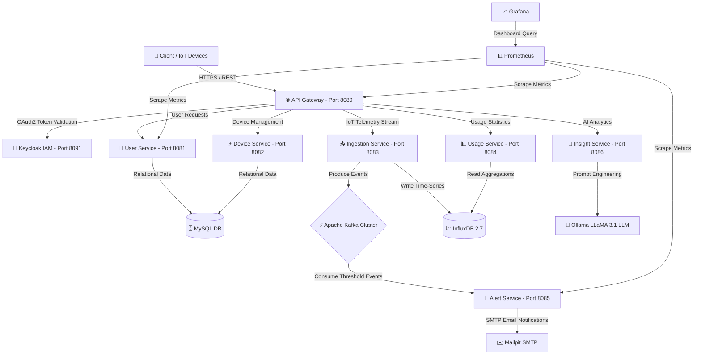

# ⚡ Home Energy Tracker — Enterprise Microservices & AI-Powered Energy Intelligence

[](https://www.oracle.com/java/)
[](https://spring.io/projects/spring-boot)
[](https://spring.io/projects/spring-ai)
[](https://kafka.apache.org/)
[](https://www.influxdata.com/)
[](https://www.keycloak.org/)
[](https://www.docker.com/)

**Home Energy Tracker**, akıllı evlerin ve endüstriyel tesislerin enerji tüketim verilerini gerçek zamanlı olarak izleyen, anomali ve yüksek tüketim durumlarında olay güdümlü (event-driven) uyarılar üreten ve **Spring AI + Ollama (LLaMA 3.1)** entegrasyonu ile kullanıcılara kişiselleştirilmiş enerji tasarrufu ve optimizasyon tavsiyeleri sunan kurumsal ölçekli bir **Mikroservis Mimarisi** platformudur.

---

## 📋 İçindekiler
- [✨ Öne Çıkan Özellikler](#-öne-çıkan-özellikler)
- [🏗️ Sistem Mimarisi](#️-sistem-mimarisi)
- [🧩 Mikroservis Kataloğu](#-mikroservis-kataloğu)
- [🤖 Yapay Zeka Entegrasyonu (Insight Service)](#-yapay-zeka-entegrasyonu-insight-service)
- [🛠️ Teknoloji Yığını (Tech Stack)](#️-teknoloji-yığını-tech-stack)
- [🚀 Kurulum ve Çalıştırma Rehberi](#-kurulum-ve-çalıştırma-rehberi)
- [📊 İzlenebilirlik ve Yönetim Panelleri](#-izlenebilirlik-ve-yönetim-panelleri)
- [🧪 Entegrasyon Testleri](#-entegrasyon-testleri)

---

## ✨ Öne Çıkan Özellikler

- **⚡ Gerçek Zamanlı Telemetri Toplama (Ingestion):** IoT akıllı sayaçlardan ve sensörlerden gelen yüksek frekanslı enerji verilerinin InfluxDB time-series veritabanına ve Kafka olay kanalına düşük gecikmeyle aktarılması.
- **🤖 Yapay Zeka Destekli Danışmanlık (Spring AI & LLaMA 3.1):** Kullanıcıların geçmiş tüketim kalıplarını analiz ederek yerel LLM modelleri (Ollama) vasıtasıyla kişiselleştirilmiş enerji tasarrufu ve maliyet optimizasyonu önerileri üretme.
- **📩 Olay Güdümlü Akıllı Uyarı Sistemi (Event-Driven Alerting):** Tüketim eşik değerleri (thresholds) aşıldığında Kafka üzerinden anlık tetiklenen event-driven e-posta ve bildirim mekanizması.
- **🔐 Kurumsal Güvenlik (Identity & Access Management):** Keycloak OAuth2/OIDC entegrasyonu ve Spring Cloud Gateway üzerinden merkezi kimlik doğrulama.
- **📈 Zaman Serisi Veri Analitiği:** InfluxDB ve Usage Service entegrasyonu ile saatlik, günlük ve aylık agregasyonlar.
- **📊 360° İzlenebilirlik & Prometheus-Grafana:** Servis metriği (Micrometer/Prometheus) ve özelleştirilmiş Grafana panelleri ile tam sistem görünürlüğü.

---

## 🏗️ Sistem Mimarisi

Sistem, gevşek bağlı (loosely coupled), yüksek ölçeklenebilir ve olay tabanlı (event-driven) mikroservis prensiplerine göre tasarlanmıştır.



---

## 🧩 Mikroservis Kataloğu

| Servis Adı | Port | Veritabanı / Ara Katman | Sorumluluk & Açıklama |
| :--- | :--- | :--- | :--- |
| **`api-gateway`** | `8080` | Spring Cloud Gateway | Merkezi yönlendirme, CORS yönetimi ve Keycloak güvenlik doğrulaması. |
| **`user-service`** | `8081` | MySQL (Flyway Migration) | Kullanıcı profili, bildirim tercihleri ve enerji eşik değerleri yönetimi. |
| **`device-service`** | `8082` | MySQL | Akıllı sayaçlar, IoT cihaz kayıtları ve cihaz-kullanıcı eşleştirmeleri. |
| **`ingestion-service`** | `8083` | InfluxDB & Kafka | Cihazlardan gelen canlı enerji verilerini InfluxDB'ye yazar ve Kafka'ya olay yayınlar. |
| **`usage-service`** | `8084` | InfluxDB | Zamana bağlı enerji kullanım istatistikleri, trend ve periyodik raporlamalar. |
| **`alert-service`** | `8085` | Kafka & Mailpit (SMTP) | Tüketim eşiği aşıldığında Kafka olaylarını dinler ve e-posta bildirimi gönderir. |
| **`insight-service`** | `8086` | Spring AI & Ollama (LLaMA 3.1) | Tüketim verilerini analiz ederek LLM tabanlı yapay zeka tasarruf tavsiyeleri üretir. |

---

## 🤖 Yapay Zeka Entegrasyonu (Insight Service)

`insight-service`, **Spring AI** altyapısını kullanarak yerel veya bulut tabanlı Büyük Dil Modelleri (LLM) ile iletişim kurar. 

### 💡 Çalışma Mantığı:
1. Kullanıcının InfluxDB üzerindeki geçmiş enerji tüketim trendleri toplanır.
2. Anomali tespiti ve pik tüketim saatleri belirlenir.
3. Spring AI `ChatClient` vasıtasıyla Ollama üzerinde çalışan **LLaMA 3.1** modeline özel olarak yapılandırılmış prompt'lar iletilir.
4. Yapay Zeka; kullanıcının cihaz bazlı tüketim alışkanlıklarını iyileştirecek aksiyon alınabilir öneriler sunar (Örn: *"Saat 17:00-20:00 arasında çamaşır makinesi kullanımı pik yapmış, tarifeli kullanıma geçerek %18 tasarruf sağlayabilirsiniz."*).

---

## 🛠️ Teknoloji Yığını (Tech Stack)

### Core Frameworks & Runtime
- **Java 21** (Virtual Threads & Performance)
- **Spring Boot 3.x / 4.x** & **Spring Cloud Gateway**
- **Spring AI** (`spring-ai-starter-model-ollama`)

### Persistence & Event Streaming
- **MySQL 8.3** (Relational Data & Entity Management)
- **InfluxDB 2.7** (Time-Series Telemetry Engine)
- **Apache Kafka (KRaft)** (Event Driven Messaging Engine)
- **Flyway** (Database Schema Versioning)

### Security & Monitoring
- **Keycloak 24.0** (Identity & Access Management)
- **Prometheus** (Metrics Harvesting)
- **Grafana 11.4** (Observability Dashboards)
- **Mailpit** (Local Mail Testing & SMTP Server)

### Testing & Quality Assurance
- **Testcontainers** (MySQL & Kafka Integration Tests)
- **JUnit 5** & **AssertJ** & **Mockito**

---

## 🚀 Kurulum ve Çalıştırma Rehberi

### 1. Ön Gereksinimler
Sisteminizin sorunsuz çalışabilmesi için aşağıdaki bileşenlerin yüklü olduğundan emin olun:
- **Docker & Docker Compose** (v24+)
- **JDK 21** veya üzeri
- **Maven** (3.8+)
- **Ollama** *(Yapay Zeka önerileri için isteğe bağlı, LLaMA 3.1 modeli ile)*

---

### 2. Altyapı Servislerinin Başlatılması (Docker)
Projenin ana dizininde aşağıdaki komutu çalıştırarak MySQL, Kafka, InfluxDB, Keycloak, Mailpit, Prometheus ve Grafana konteynerlerini başlatın:

```bash
docker compose up -d
```

Konteynerlerin durumunu kontrol etmek için:
```bash
docker compose ps
```

---

### 3. Ollama (AI Modeli) Hazırlığı *(Opsiyonel)*
`insight-service` yapay zeka servisini kullanmak için Ollama üzerinde `llama3.1` modelini indirin:

```bash
ollama pull llama3.1
```

---

### 4. Mikroservislerin Derlenmesi ve Başlatılması

Tüm projeyi ana dizinden derlemek için:

```bash
mvn clean package -DskipTests
```

Servisleri sırasıyla veya IDE üzerinden çalıştırabilirsiniz:
1. `user-service`
2. `device-service`
3. `ingestion-service`
4. `usage-service`
5. `alert-service`
6. `insight-service`
7. `api-gateway`

---

## 📊 İzlenebilirlik ve Yönetim Panelleri

Altyapı ayağa kalktığında aşağıdaki arayüzlere web tarayıcınızdan erişebilirsiniz:

| Panel / Servis | URL | Varsayılan Kimlik Bilgileri |
| :--- | :--- | :--- |
| 🌐 **API Gateway** | `http://localhost:8080` | Servis Yönlendirmeleri |
| 🔐 **Keycloak Admin Console** | `http://localhost:8091` | `admin` / `admin` |
| 📈 **Grafana Dashboards** | `http://localhost:3000` | `admin` / `admin` |
| 📊 **Prometheus Metrics** | `http://localhost:9090` | - |
| ⚡ **Kafka UI** | `http://localhost:8070` | Kafka Cluster İzleme |
| 📈 **InfluxDB UI** | `http://localhost:8086` | `admin` / `password` |
| ✉️ **Mailpit Web UI** | `http://localhost:8025` | Yakalanan E-postalar |

---

## 🧪 Entegrasyon Testleri

Tüm mikroservislerde gerçek veritabanı ve Kafka ortamı simülasyonu için **Testcontainers** kullanılmaktadır. Integration testlerini çalıştırmak için Docker'ın aktif olması yeterlidir:

```bash
# Sadece user-service entegrasyon testlerini çalıştırmak için:
cd user-service
mvn test
```

---

## 📜 Lisans & İletişim

Bu proje kurumsal ölçekte mikroservis ve yapay zeka entegrasyonu mimari standartlarına uygun olarak tasarlanmıştır.

- **Geliştirici:** Enes Çelebi
- **Repository:** [Home-Energy-Tracker-with-MicroServices](https://github.com/enescelebii/Home-Energy-Tracker-with-MicroServices)
